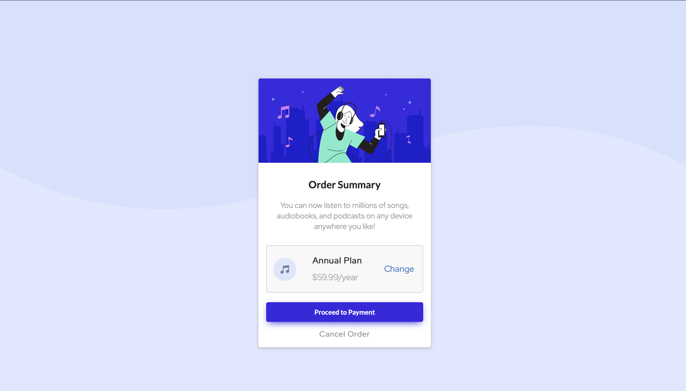

# Frontend Mentor - Order summary card solution

This is a solution to the [Order summary card challenge on Frontend Mentor](https://www.frontendmentor.io/challenges/order-summary-component-QlPmajDUj). Frontend Mentor challenges help you improve your coding skills by building realistic projects. 

## Table of contents

- [Overview](#overview)
  - [The challenge](#the-challenge)
  - [Screenshot](#screenshot)
  - [Links](#links)
- [My process](#my-process)
  - [Built with](#built-with)
  - [What I learned](#what-i-learned)
  - [Continued development](#continued-development)
  - [Useful resources](#useful-resources)
- [Author](#author)
- [Acknowledgments](#acknowledgments)

## Overview

### The challenge

Building an Order Summary page

### Screenshot

### Links

- Solution URL: [Order Summary](https://github.com/RoosterRoo/OrderSummary)
- Live Site URL: [Github Pages](https://roosterroo.github.io/OrderSummary/)

## My process

### Built with

- Semantic HTML5 markup
- CSS custom properties
- Semantic UI
- [React](https://reactjs.org/) - JS library

### What I learned

This project helped me learn about the 'negative spread' in CSS for box shadow. I learnt HTML5
and CSS3 before but did not have a project, so this was a good start. I learnt how to use custom CSS properties on top of Semantic UI which was interesting to say the least.
 

### Continued development

I have thought of moving to Styled Components since I know some custom styling is still needed
in this project which might not be possible with Semantic UI or might not know that specific
topic in Semantic UI.

### Useful resources

- [StackOverflow](https://stackoverflow.com/questions/12798902/box-shadow-for-bottom-side-only) - This helped me for the box shadowing part. Will be using this and learning more.
- [Semantic UI](https://semantic-ui.com) - CSS library.
- [FrontendMentor Discord App] - Helped me with getting my background image positioned properly.

## Author

- Website - [Sayan De](https://www.linkedin.com/in/sayan-de-b42244b7/)
- Frontend Mentor - [@RoosterRoo](https://www.frontendmentor.io/profile/RoosterRoo)

## Acknowledgments

Special thanks to StackOverflow(obviously) and Abdullah Farea for helping out with the project.
